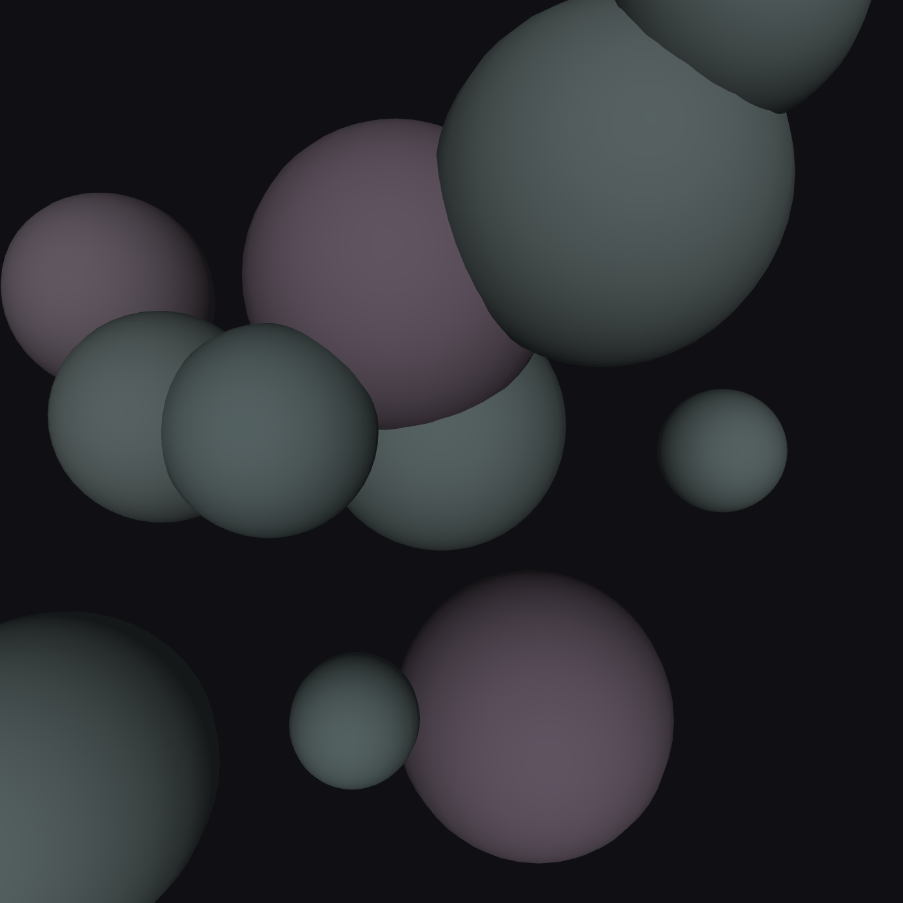
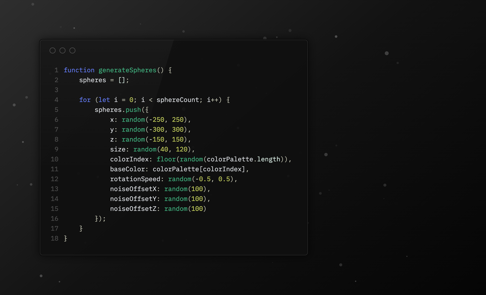
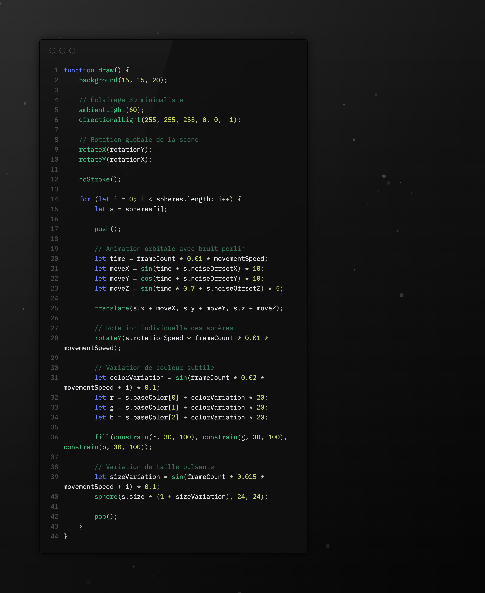
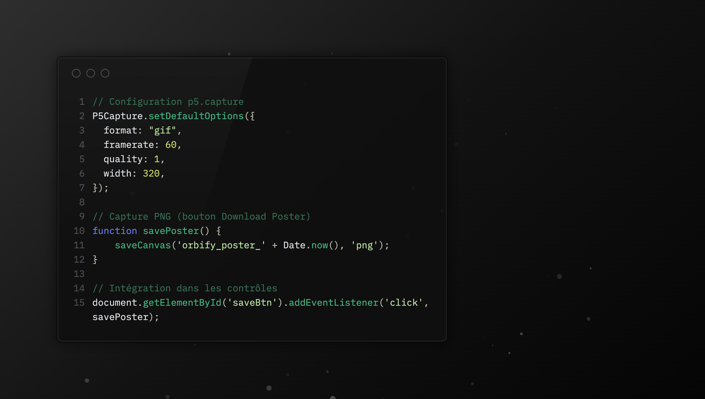
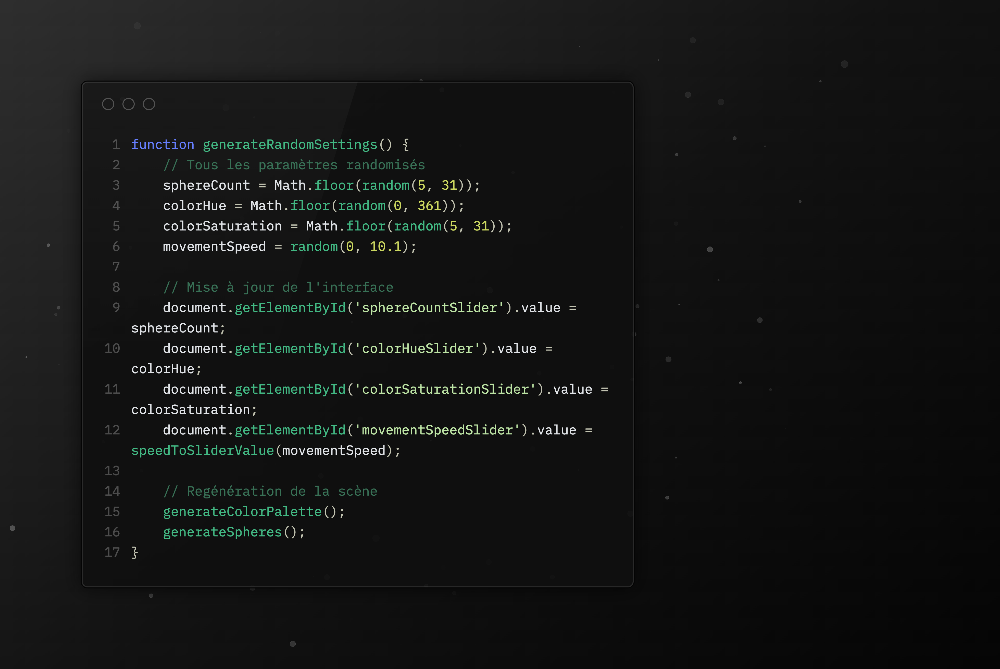

# ⚫️ Orbify

*example of the result*

## About

Orbify is an interactive art generator that turns mathematical patterns into beautiful animations. It blends code with creativity, letting anyone design unique visual experiences where science and art connect.

## **Color Controls**
- **Color Hue** : Controls the main color tone (0-360°) following the standard color wheel - 0° is red, 180° is cyan, and 360° returns to red.
- **Saturation** : Controls the color intensity (0-100%) - 0% is grayscale, 100% is fully saturated vibrant colors.

## **Composition Controls**
- **Number of Spheres** : Sets the quantity of orbiting spheres (5-30) - more spheres create denser, more complex patterns.
- **Movement Speed** : Controls the animation pace (0.0-10.0x) with logarithmic scaling for finer control at slower speeds and wider range at higher speeds.

## **Export & Recording**
- **GIF Recording** : Built-in recording tool to capture animated GIFs of your orbital patterns with customizable framerate and quality settings.
- **Download Poster** : Exports the current 3D scene as a high-quality PNG image suitable for printing or sharing.

## **Interaction Controls**
- **Generate New** : Randomizes all parameters (spheres, colors, speed) to instantly create new unique compositions.
- **3D Rotation** : Click and drag on the canvas to rotate the orbital scene in real-time for different viewing angles.
- **Theme Toggle** : Switch between dark mode (default) and light mode for different visual preferences and ambient lighting.

## **Keyboard Shortcuts**
- **Spacebar** : Randomize all parameters
- **S** : Save current view as PNG
- **+/-** : Increase/decrease number of spheres
- **[ ]** : Decrease/increase movement speed
- **0** : Reset speed to 1.0x
- **R** : Start/stop GIF recording

## **Visual Aesthetic**

**Atmosphere & Mood**
- Monochromatic dark theme with subtle blue-gray accents
- Industrial-minimalist aesthetic inspired by technical interfaces
- Low-contrast design promoting visual comfort during extended use

**Typography & Textures**
- Clean `Courier New` monospace font throughout interface
- Subtle letter-spacing for enhanced readability
- Matte finish controls with soft border definitions
- Gradient-free, flat color fields with delicate surface textures

**Visual Hierarchy**
- Layered containers with barely perceptible borders
- Strategic use of negative space and airy padding
- Discreet value indicators with understated typography
- Unobtrusive slider controls with minimal visual weight

## Snippets
#### Generate the spheres inside the canva

#### Generate the animation of the spheres

#### p5.capture for recording

#### Randomize the scene
