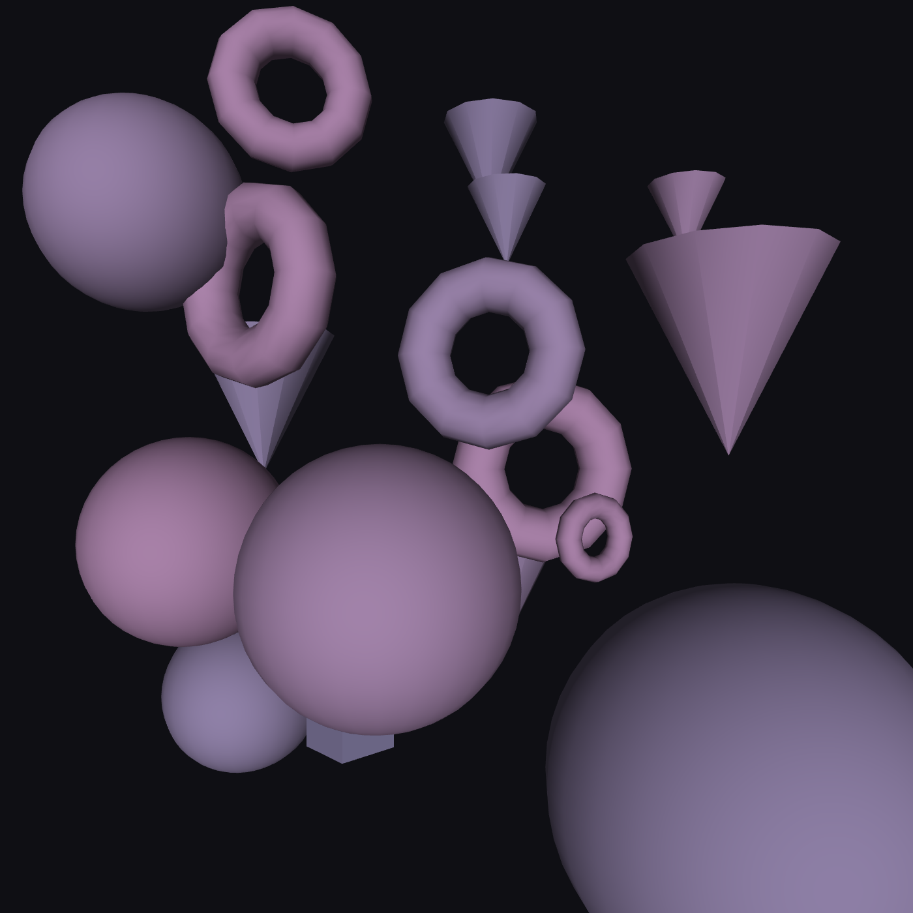

# ⚫️ Atomic

*example of a random generation*
## About
Atomic is an interactive 3D particle generator that transforms mathematical patterns into mesmerizing visual compositions. Inspired by atomic structures and molecular dynamics, it blends computational art with scientific visualization, allowing anyone to create unique particle systems where geometry meets motion in a virtual 3D space.

## Color Controls
- **Color Hue** : Controls the main color tone (0-360°) following the standard color wheel - 0° is red, 180° is cyan, and 360° returns to red.

- **Saturation** : Controls the color intensity (0-100%) - 0% is grayscale, 100% is fully saturated vibrant colors.

## Composition Controls
- **Shape Count** : Sets the quantity of orbiting shapes (5-30) - more shapes create denser, more complex patterns.

- **Movement Speed** : Controls the animation pace (0.0-10.0x) with logarithmic scaling for finer control at slower speeds and wider range at higher speeds.

## Atomic Composition
- **Shape Distribution** : Individual percentage controls for four geometric primitives:

- **Spheres (●) :** Classic spherical particles with smooth surfaces

- **Cubes (▢) :** Cubic structures rendered with 3D perspective

- **Torus (⭘) :** Ring-shaped particles with orbital dynamics

- **Cones (△) :** Conical forms with depth and dimension

- **Smart Percentage System :** All shape percentages automatically total 100%, with intelligent redistribution when adjusting individual sliders

## Quick Controls

- **Reset :** Returns to 100% spheres configuration

- **Equalize :** Evenly distributes percentages among active shapes

## Export & Recording
- **GIF Recording :** Built-in recording tool to capture animated GIFs of your particle systems with customizable framerate (15-60 FPS) and quality settings.

- **Download Image :** Exports the current 3D scene as a high-quality PNG image (700×700 pixels) suitable for printing or sharing.

## Interaction Controls
- **Generate New :** Randomizes all parameters (particles, colors, speed, shape distribution) to instantly create new unique compositions.

- **3D Rotation :** Click and drag on the canvas to rotate the particle scene in real-time for different viewing angles and perspectives.

- **Theme Toggle :** Switch between dark mode (default) and light mode for different visual preferences and ambient lighting conditions.

## Keyboard Shortcuts
- **Spacebar :** Randomize all parameters including shape distribution

- **S :** Save current view as PNG image

- **+/- :** Increase/decrease particle count

- **[ ] :** Decrease/increase movement speed

- **0 :** Reset speed to 1.0x

- **R :** Start/stop GIF recording

## Atmosphere & Mood

 - Monochromatic dark theme with subtle blue-gray accents

- Industrial-minimalist aesthetic inspired by scientific interfaces

- Low-contrast design for extended visual comfort

- Dual theme system (dark/light) for different environments

## Typography & Textures

- Clean `Courier New` monospace font for technical precision

- Subtle letter-spacing for enhanced readability

- Matte finish controls with soft borders

- Flat color fields with minimal shadows

## Visual Hierarchy

- Layered containers with subtle borders for depth

- Strategic negative space for balanced composition

- Discreet value indicators that inform without distracting

- Color-coded shape controls for intuitive interaction

#### Generate the spheres inside the canva

#### Generate the animation of the spheres

#### p5.capture for recording

#### Randomize the scene

## 📄 License & Credits
Atomic Generator v1.0
Software provided under MIT License
Generated artworks are the copyright of their respective creators